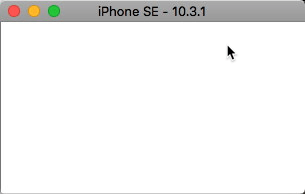

SpriteBar Swift version - Draw your own progress bar in Sprite Kit.
=========

This library is a convenient way to create your own SKSpriteNode progress bars in Apple's Sprite Kit. Simply pass in a Texture Atlas containing your sprites and SpriteBar will do the rest.

[](https://developer.apple.com/swift)
[](https://travis-ci.org/Alamofire/Alamofire)
[](https://developer.apple.com/iphone/index.action)
[](/LICENSE)

 

## Features

- Progress bar generation from SKTextureAtlas.
- Automatically scales the animation, allowing you to provide as many frames as you want. From 2 to 100!
- Finds the closest texture file to the percent provided.
- Built in timer function starts animating the progress bar with your graphics.

## Installation

Simply drag the SpriteBar folder into your project and use <code>#import "SpriteBar.h"</code>.
Make sure you have followed the naming convention for your texture frames:
(you may specify a texure reference to replace *progress* using <code>textureReference</code>)
```
progress_0.png
progress_10.png
progress_20.png
progress_30.png
etc
```

## Usage

```swift
// Init and add
let progressBar = SpriteBar(textureAtlas:myCustomTextureAtlas)
progressBar.size = CGSize(width:300, height: 50);
addChild(progressBar)

progressBar.setProgress(0.2)
// or
progressBar.setProgressWithValue(36, ofTotal:200)
// or
progressBar.startBarProgressWithTimer(10, target:self, selector: #selector(self.timeOver))

// the function timeOver could be:
@objc func timeOver() {
   print("time is over")
}
```

## Credits & Contact
SpriteBar was created by [Henry Everett](http://www.henryeverett.info/)  
Twitter: [@henryeverett](https://www.twitter.com/henryeverett)  
GitHub: [henryeverett](https://github.com/henryeverett)
It was converted to Swift 4 by [Alessandro Ornano](http://www.alessandroornano.com/)
GitHub: [aornano](https://github.com/aornano/)

